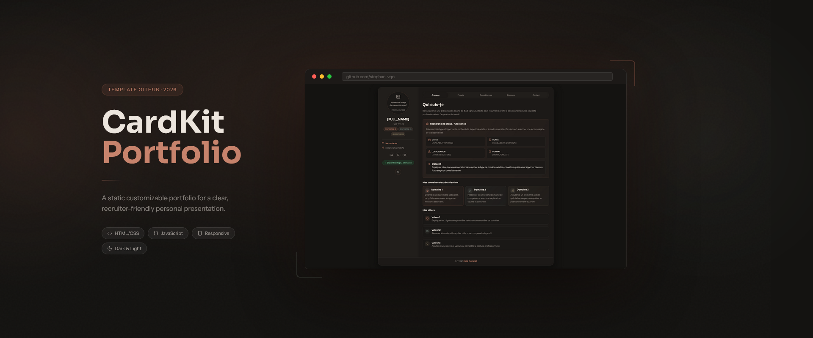
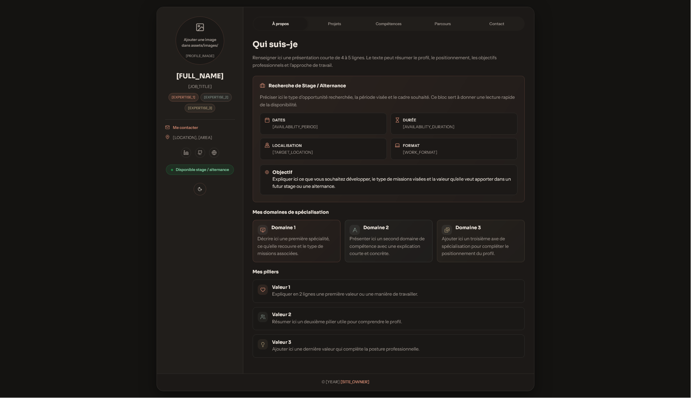
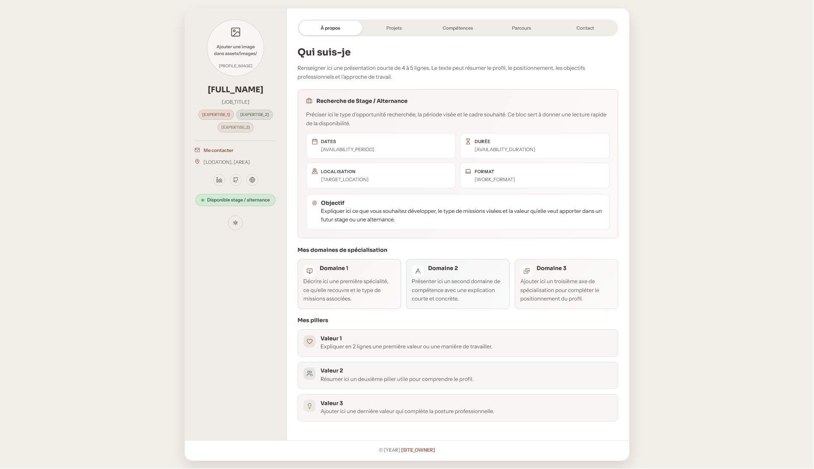

# CardKit - Portfolio Template



> 🇫🇷 French version: [README.fr.md](README.fr.md)  
> 📚 User guides: [guide-en.md](guide-en.md) | [guide-fr.md](guide-fr.md)  
> 📅 Project date: January 2026  
> 🔄 Project version: May 2026

CardKit is a static portfolio template built with HTML, CSS, and JavaScript for a clear, recruiter-friendly personal presentation. It is designed as a customizable starting point, not as a portfolio to publish unchanged.

The current template includes a profile sidebar, tabbed sections, expandable project detail views, light and dark mode, a contact map, and graceful fallbacks for missing media or unavailable JavaScript.

## Table of contents

- [Overview](#overview)
- [UI Preview](#ui-preview)
- [Main features](#main-features)
- [Project structure](#project-structure)
- [Key files](#key-files)
- [How to use](#how-to-use)
- [Guide](#guide)
- [Before publishing](#before-publishing)
- [Notes](#notes)
- [Workflow & tools](#workflow--tools)
- [Project Outlook](#project-outlook)
- [Closing word](#closing-word)

## Overview

- Single-page static portfolio template
- No build step required
- Default content and interface labels are in French
- Built to be customized before publication
- Detailed guides are provided in English and French

## UI Preview

| Dark Theme                                                                      | Light Theme                                                                            |
| ------------------------------------------------------------------------------- | -------------------------------------------------------------------------------------- |
|  |  |

## Main features

- Responsive layout with sidebar and tabbed content
- Project cards with separate detailed views
- Light and dark theme toggle with saved preference
- Map section powered by [OpenStreetMap](https://www.openstreetmap.org/) and [Leaflet](https://leafletjs.com/)
- Icons by [Lucide](https://lucide.dev/)
- Avatar and project image fallbacks
- Usable fallback when JavaScript is disabled
- SEO placeholders and safe default publishing settings in `index.html`

## Project structure

```text
.
├── index.html
├── README.md
├── README.fr.md
├── guide-en.md
├── guide-fr.md
├── LICENSE
└── assets/
    ├── css/
    │   └── style.css
    ├── js/
    │   └── script.js
    ├── images/
    │   ├── favicon.svg
    │   ├── preview-template.png
    │   ├── preview-template-light.png
    │   ├── template-github-dark_project-cover.webp
    │   └── template-github-light_project-cover.webp
    └── docs/
```

## Key files

| File | Purpose |
| --- | --- |
| `index.html` | Main page structure, placeholders, SEO base, and external CDN links |
| `assets/css/style.css` | Theme variables, layout, components, and responsive styles |
| `assets/js/script.js` | Tabs, project detail switching, theme handling, Leaflet map, and media fallbacks |
| `guide-en.md` | English customization guide |
| `guide-fr.md` | French customization guide |
| `assets/images/favicon.svg` | Editable SVG favicon template |

## How to use

1. Clone or download the repository.
2. Open the project folder in a code editor.
3. Open `index.html` in your browser to preview the template.
4. Edit the main content in `index.html`.
5. Update the appearance in `assets/css/style.css`.
6. Adjust the interactions and settings in `assets/js/script.js`.
7. Add your own images and documents to `assets/images/` and `assets/docs/`.
8. Read the guide before publishing.

## Guide

For detailed customization instructions, use:

- [guide-en.md](guide-en.md)
- [guide-fr.md](guide-fr.md)

The guides cover placeholders, text to rewrite, expected files, colors, fonts, map settings, deliverables, icons, SEO metadata, and final checks.

## Before publishing

- Replace all bracket placeholders and temporary example links
- Add real images and optional deliverables
- Review SEO metadata and social sharing tags in `index.html`
- Remove or update the default `noindex, nofollow` setting when the site is ready
- Customize the favicon, contact details, and map location

## Notes

- The current HTML document is set to French (`lang="fr"`), with French interface labels by default.
- The project uses Google Fonts, Lucide, and Leaflet from CDNs.
- The repository already includes a preview image and a customizable SVG favicon.

## Workflow & tools

- [Figma](https://www.figma.com/) — initial prototype
- [Visual Studio Code](https://code.visualstudio.com/) — code editing
- [GitHub](https://github.com/) — repository hosting
- [GitHub Pages](https://pages.github.com/) — planned live demo
- [Firefox Developer Tools](https://firefox-source-docs.mozilla.org/devtools-user/) — testing and adjustments
- [WAVE Evaluation Tool](https://wave.webaim.org/) — accessibility check

## Project Outlook

This template provides a first functional base that may be gradually expanded.

The next planned steps include:

* publishing a live demo with GitHub Pages;
* improving the user documentation;
* refining and expanding the interface;
* adding new section or component variants if needed.

## Closing word

Thanks for checking out this template project.  
Feel free to adapt it, refine it, and turn it into a portfolio that genuinely reflects your profile.
